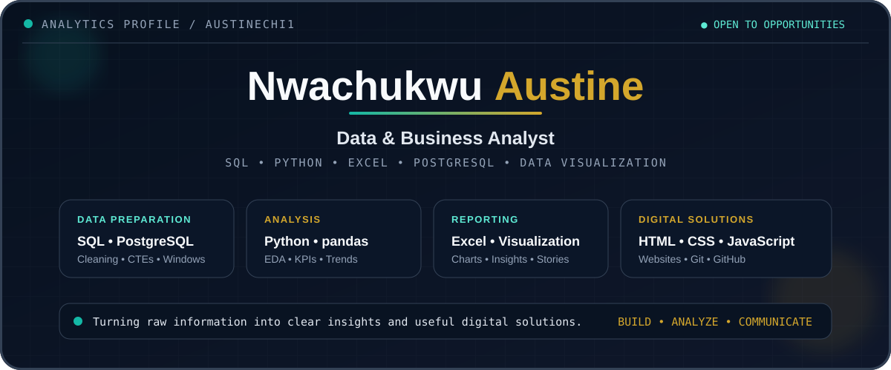

  

  
  
  

## About Me

I am **Nwachukwu Austine**, an Information Systems and Technology student building practical solutions with data and technology. My background in television broadcasting, video production, graphic design, and media operations helps me combine analytical thinking with clear visual communication.

I am developing a portfolio in **data analytics, business analysis, database management, and web development**, with a focus on turning raw information into understandable insights and useful digital experiences.

## Analytics Toolkit

  
  
  
  
  
  

## Development & Creative Skills

  
  
  
  
  

## Featured Work

| Project | What it demonstrates | Tools |
|---|---|---|
| **[StreamWave Content Performance Analytics](https://github.com/austinechi1/StreamWave_Analytics_Portfolio)** | End-to-end cleaning, exploration, visualization, KPI analysis, and business recommendations using 15,035 synthetic streaming records | PostgreSQL, SQL, Python, pandas, Matplotlib, Seaborn |
| **[S.H.E. Social Website](https://github.com/austinechi1/she_social_web)** | Business website development and ongoing digital project management | HTML, CSS, JavaScript, GitHub |
| **Personal Portfolio** | A growing showcase of analytics and web-development projects | GitHub Pages, HTML, CSS, JavaScript |

## What I Am Working On

- Building realistic data analytics portfolio projects
- Strengthening SQL, PostgreSQL, Python, and Excel skills
- Applying business questions to data and communicating actionable findings
- Managing and improving live websites for businesses and organizations

## GitHub Activity

  
  

---

<strong>Open to internships, collaborations, and entry-level opportunities in data and business analytics.</strong>

