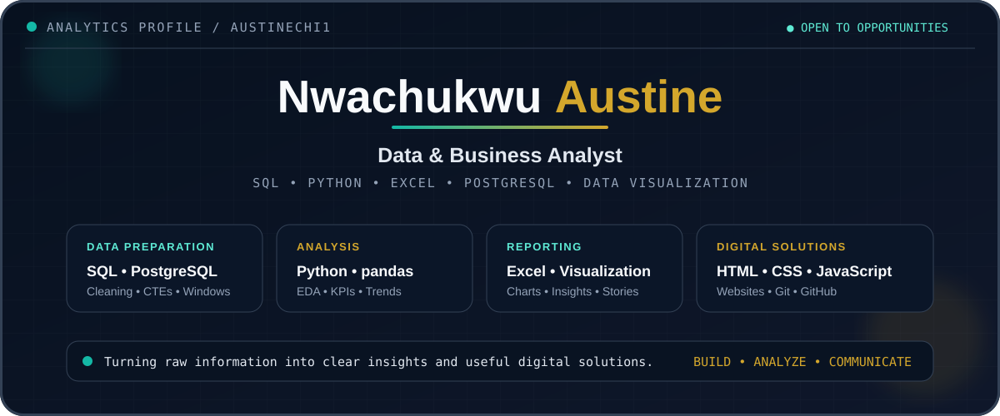

  

  
  
  

# Nwachukwu Austine

### Data Analyst | SQL | Python | Power BI

I turn raw data into **business insights, clear dashboards, and practical recommendations**.

I am an Information Systems and Technology student building hands-on experience across data analytics, business intelligence, databases, and AI-assisted analytics. My background in television broadcasting, video production, and visual communication also helps me present analytical findings in a clear and engaging way.

## Analytics Toolkit

  
  
  
  
  
  
  
  

## Featured Analytics Projects

These four projects best represent my current analytics portfolio, from public-data analysis to dashboards and AI-assisted exploration.

| Project | Business / Analytics Focus | Tools |
|---|---|---|
| **[Consumer Financial Complaints Intelligence](https://github.com/austinechi1/Consumer-Financial-Complaints-Analysis)** | Public CFPB complaint trends, product and geographic concentration, response performance, data quality, and advanced SQL analysis | PostgreSQL, SQL, Python, Pandas, Streamlit, Plotly |
| **[AI Data Analyst](https://github.com/austinechi1/AI-Data-Analyst)** | Data profiling, cleaning, KPI generation, natural-language SQL, visualizations, and result-backed business insights | Python, Pandas, SQLite, SQL, Streamlit, Plotly, OpenAI |
| **[UK Online Retail Performance Dashboard](https://github.com/austinechi1/UK-Online-Retail-PowerBI-Dashboard)** | Retail revenue, customer behaviour, product performance, returns, KPIs, and interactive business reporting | Power BI, Power Query, DAX, Data Modelling |
| **[Nexus Supply Chain Analytics](https://github.com/austinechi1/Nexus-Supply-Chain-Analytics)** | Procurement, inventory, supplier performance, forecasting, delivery risk, and operational decision support | Excel, Python, Pandas, Forecasting, Plotly, Streamlit |

## My Analytics Workflow

**Business Question → Data Collection → Cleaning & Validation → SQL/Python Analysis → KPI & Visualization → Insight → Recommendation**

I focus on making analysis reproducible and connecting technical work to a business question rather than presenting charts without context.

## Currently Building

- Strengthening advanced SQL and PostgreSQL
- Developing Power BI and DAX skills
- Building reproducible Python analytics workflows
- Improving forecasting, risk analysis, and business intelligence
- Exploring practical AI-assisted analytics tools

## More Analytics Projects

- **[StreamWave Content Performance Analytics](https://github.com/austinechi1/StreamWave_Analytics_Portfolio)** — a streaming analytics case study using clearly labeled synthetic data and modeled revenue.

## Other Digital Projects

Outside my core analytics portfolio, I also build and manage digital products and websites:

- **[S.H.E. Social Website](https://github.com/austinechi1/she_social_web)**
- **[Yahflex Website](https://github.com/austinechi1/yahflex-website)**
- **[Personal Portfolio](https://austinechi1.github.io/)**
- **[The Gap](https://github.com/austinechi1/the_gap)**
- **[Let My Worship Rise](https://github.com/austinechi1/let_my_worship_rise)**

These projects reflect my broader experience in web development, digital media, visual communication, and technology.

## Career Direction

I am seeking opportunities in:

- Data Analytics
- Business Analytics
- Business Intelligence
- Entry-level Data Analyst roles
- Analytics internships

<strong>Data → Insight → Decision</strong>

